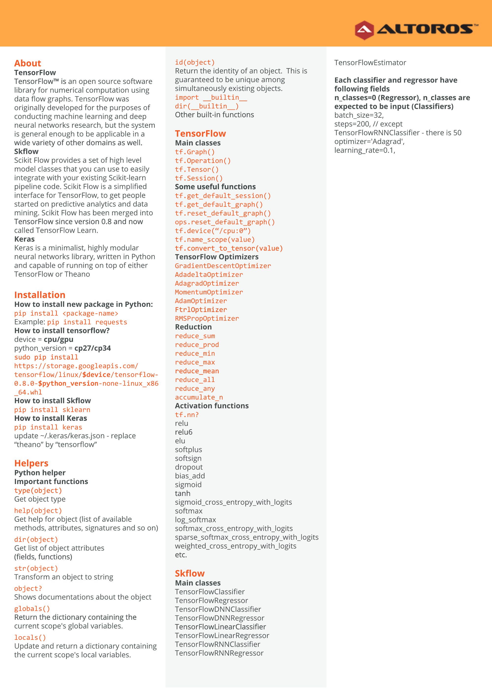
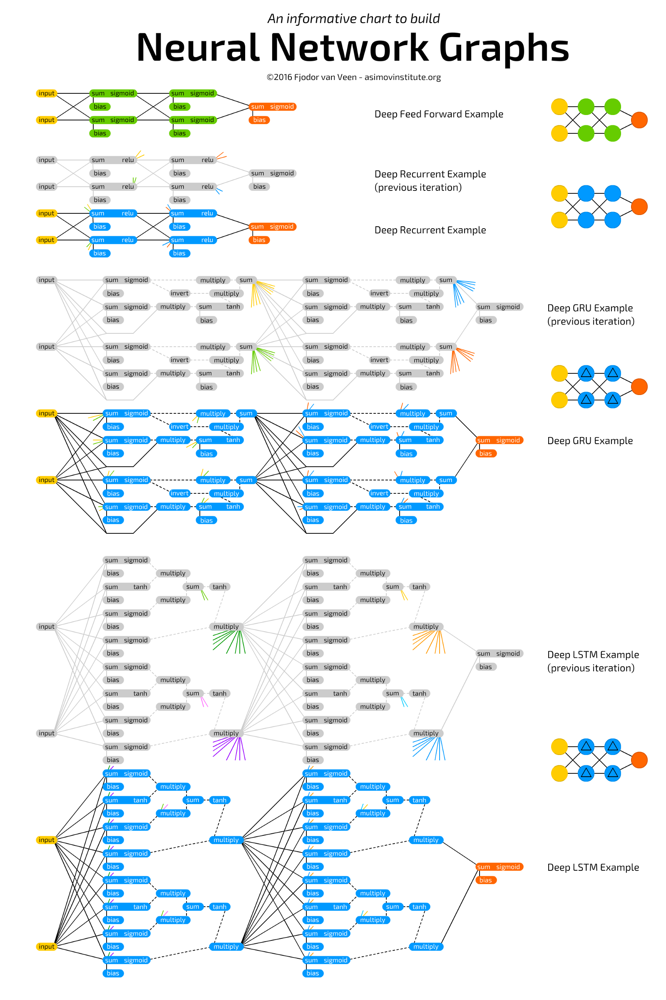

# Awesome-Cheat-Sheet

Cheat sheets for quick learn and recall.

* [Data Science](#data-science)
* [Data Visualization](#data-visualization)
* [Machine Learning](#ml)
* [Network](#network)
* [Mathmatics](#math)

<h2 id="data-science">Data Science</h2>

[Another Pandas cheat sheet](cheat-sheets/Pandas_Cheat_Sheet.pdf)

<h2 id="data-visualization">Data Visualization</h2>

[CSS3 Cheat Sheet](cheat-sheets/css3-cheat-sheet.pdf)

<h2 id="ml">Machine Learning</h2>

<h2 id="network">Network</h2>

[Apache Reference](cheat-sheets/apache-quick-reference.pdf)

[htaccess reference](cheat-sheets/htaccess-cheat-sheet.pdf)

<h2 id="math">Mathmatics</h2>

